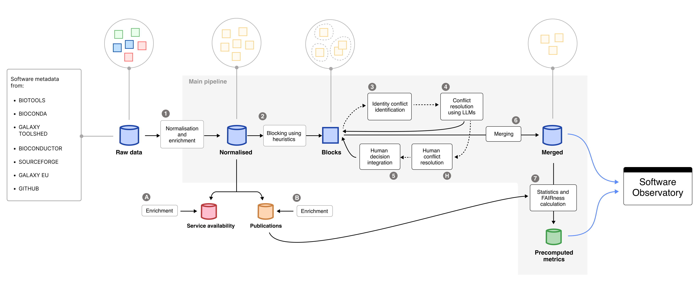

# Pipeline Stages  

## Overview  

The **Research Software Observatory – Data Pipeline** orchestrates the consolidation, enrichment, and integration of software metadata into analysis-ready datasets consumed by the [Research Software Observatory](https://openebench.bsc.es/observatory/).



<p align="center" style="font-size: 15px"><i>
Overview of the main and auxiliary pipelines of the Research Software Observatory.  
Raw data importers are external to this repository and act as upstream inputs.
</i></p>

The pipeline operates downstream of independent importer processes, which periodically collect and normalize metadata from external registries such as **bio.tools**, **Bioconda**, **Galaxy**, and others. These importer components are maintained separately and populate the *raw data layer*, which serves as the entry point of this pipeline.

The pipeline then performs:

- **Normalization and enrichment** of software metadata  
- **Integration and disambiguation** of duplicate records  
- **FAIRsoft score computation** and statistics generation  
- **Auxiliary enrichments** such as publications and service availability  

---

## Execution model

In normal maintenance work, the pipeline is usually executed in one of two ways:

1. **Run the main pipeline until disambiguation**  
   This is the usual option when new identity conflicts may require human review. The pipeline generates the intermediate files, performs automated disambiguation, and creates the outputs needed for manual annotation.

   ```bash
   rsetl run --until disambiguation --tag <TAG>
   ```

2. **Run the full pipeline**  
   This is used when the data can be processed end-to-end, or when no manual curation round is expected.

   ```bash
   rsetl run --tag <TAG>
   ```

After human annotation has been completed and committed, the **latest relevant run should be resumed from the `human_updates` stage**. This reuses the existing run directory and applies the curator decisions before continuing with merge, statistics, and FAIRsoft scoring.

```bash
rsetl run --resume-run latest --from-stage human_updates
```

Alternatively, use the explicit run ID:

```bash
rsetl run --resume-run <RUN_ID> --from-stage human_updates
```

This is important because the human annotations correspond to the conflict files generated in that specific run. Starting a fresh run after annotation may produce different block or conflict identifiers and can make the annotations impossible to apply correctly.

---

## Main pipeline stages

The full pipeline is composed of the following stages, in execution order:

| # | Stage | CLI Module / Script | Description | External Services |
|:-:|:------|:--------------------|:------------|:------------------|
| 1 | **Transformation** | `src.adapters.cli.transformation.transformation` | Loads and normalizes raw metadata from MongoDB sources. | MongoDB |
| 2 | **License normalization** | `src.adapters.cli.post_transformation.normalize_licenses` | Maps license information to standardized SPDX identifiers. | MongoDB |
| 3 | **Grouping / blocking & recovery** | `src.adapters.cli.integration.group_and_recovery` | Groups records into candidate identity blocks using names and repository-like links. | MongoDB |
| — | **Remove OEB metrics** | `scripts/utils/remove_oeb_metrics.py` | Removes redundant OpenEBench metric entries to reduce noise and processing time. | — |
| 4 | **Conflict detection** | `src.adapters.cli.integration.conflict_detection` | Identifies disconnected records within blocks as potential identity conflicts. | — |
| — | **Simplify blocks** | `scripts/utils/simplify_grouped_entries.py` | Reduces block structure to the minimal representation needed downstream. | — |
| — | **JSON to JSONL conversion** | `scripts/utils/json_to_jsonl.py` | Converts conflict and block files into JSONL format. | — |
| 5 | **Disambiguation** | `src.adapters.cli.integration.disambiguation` | Resolves conflicts using heuristics and LLM-based agreement scoring. Can generate manual-review issues for unresolved cases. | OpenRouter, Hugging Face, GitHub, GitLab |
| 6 | **Human updates** | `src.adapters.cli.integration.update_disambiguation_after_human_resolution` | Integrates curator decisions from `human_annotations/` into the disambiguation output. | Git |
| 7 | **Merge** | `src.adapters.cli.integration.merge_entries` | Consolidates resolved records into unified software entries. | MongoDB |
| 8 | **Statistics** | `src.adapters.cli.generate_stats` | Computes descriptive statistics for Observatory dashboards. | MongoDB |
| 9 | **FAIRsoft scoring** | `src.adapters.cli.fair_scores` | Computes FAIRsoft indicators and scores for software entries. | MongoDB |

---

## Practical maintenance workflow

### Standard run with possible human curation

Use this when you expect some conflicts to require manual review.

```bash
rsetl run --until disambiguation --tag <TAG>
```

Then complete and commit the human annotations.

Once annotation is finished, resume the same run:

```bash
rsetl run --resume-run latest --from-stage human_updates
```

This executes:

- `human_updates`
- `merge`
- `stats`
- `fairsoft`

unless one of those stages is skipped with a command-line option.

### Full automatic run

Use this when you want to execute the full pipeline in one pass.

```bash
rsetl run --tag <TAG>
```

### Resume a specific run

Use this when the run to resume is not the latest one.

```bash
rsetl run --resume-run <RUN_ID> --from-stage human_updates
```

### Run only one stage

Useful for debugging or recomputing a downstream step.

```bash
rsetl run --resume-run <RUN_ID> --only stats
```

---

## Outputs

### Primary outputs

The pipeline produces:

- **Merged software records**, stored in MongoDB. The default target collection is `tools`.
- **Precomputed metrics and FAIRsoft scores**, stored in MongoDB. The default target collection is `computations`.

### Run artifacts

Each execution generates a versioned run directory under:

```text
data/integration/runs/<run_id>/
```

Typical contents:

```text
├── grouped_entries.<run_id>.json
├── grouped_entries.no_opeb_metrics.<run_id>.json
├── conflicts.<run_id>.json
├── grouped_entries.simplified.<run_id>.json
├── conflicts.<run_id>.jsonl
├── grouped_entries.simplified.<run_id>.jsonl
├── disambiguation.<run_id>.jsonl
└── manifest.json
```

A `latest` symlink points to the most recent run directory.

The `manifest.json` file records:

- run ID and run directory  
- git short SHA  
- created and last-updated timestamps  
- paths to generated files  
- selected and executed stages  
- latest execution options  
- masked environment configuration  
- execution history for resumed runs  

---

## Auxiliary pipelines

Auxiliary pipelines run independently from the main integration workflow.

### Publications enrichment

| Field | Value |
|------|------|
| CLI | `rsetl enrich-publications` |
| Module | `adapters.cli.enrich_publications` |
| Description | Enriches publication metadata, citation counts, and cited-by counts using Europe PMC. |
| Output | Updates the MongoDB publication collection, `publicationsMetadataDev` by default, and optionally writes a JSONL cache. |
| External services | Europe PMC API |

For each publication the enrichment fetches:

- **Metadata** — title, abstract, authors, journal, year, PMID, and source identifier.
- **`citations`** — publications that cite this paper, grouped by year, sourced from the Europe PMC [`/{source}/{id}/citations`](https://europepmc.org/RestfulWebService) endpoint.
- **`citedBy`** — same dataset as `citations`, stored under a dedicated field for downstream consumers that distinguish between outgoing and incoming citation relationships.

Both `citations` and `citedBy` are stored as a list with a single entry of the form:

```json
[
  {
    "source": "Europe PMC",
    "count": {
      "2020": 3,
      "2021": 7,
      "total": 10
    }
  }
]
```

Examples:

```bash
rsetl enrich-publications --limit 100
rsetl enrich-publications --progress-every 100
rsetl enrich-publications --no-update-db
rsetl enrich-publications --no-skip-existing-europe-pmc-citations
```

### Web availability

| Field | Value |
|------|------|
| CLI | `rsetl run-webavailability` |
| Module | `adapters.cli.web_availability` |
| Description | Checks availability of tool URLs and web services. |
| Output | Updates the MongoDB collection used for service availability dashboards. |
| External services | HTTP endpoints |

Example:

```bash
rsetl run-webavailability
```

---

## Notes for maintainers

- The pipeline is stage-driven and resumable.
- Use `--until disambiguation` when a human annotation round is expected.
- After human annotation, resume the same run from `human_updates`; do not start a fresh run for the annotation integration step.
- Use `rsetl runs list` and `rsetl runs latest` to identify available runs.
- Use `--only` for targeted recomputation of individual stages.
- Use `--dry-run-disambiguation` to test the disambiguation stage without creating conflict files or GitHub issues.
- See [CLI Reference](cli.md) for all available command-line options.
- See [Development Guide](development.md) for extending or customizing stages.
